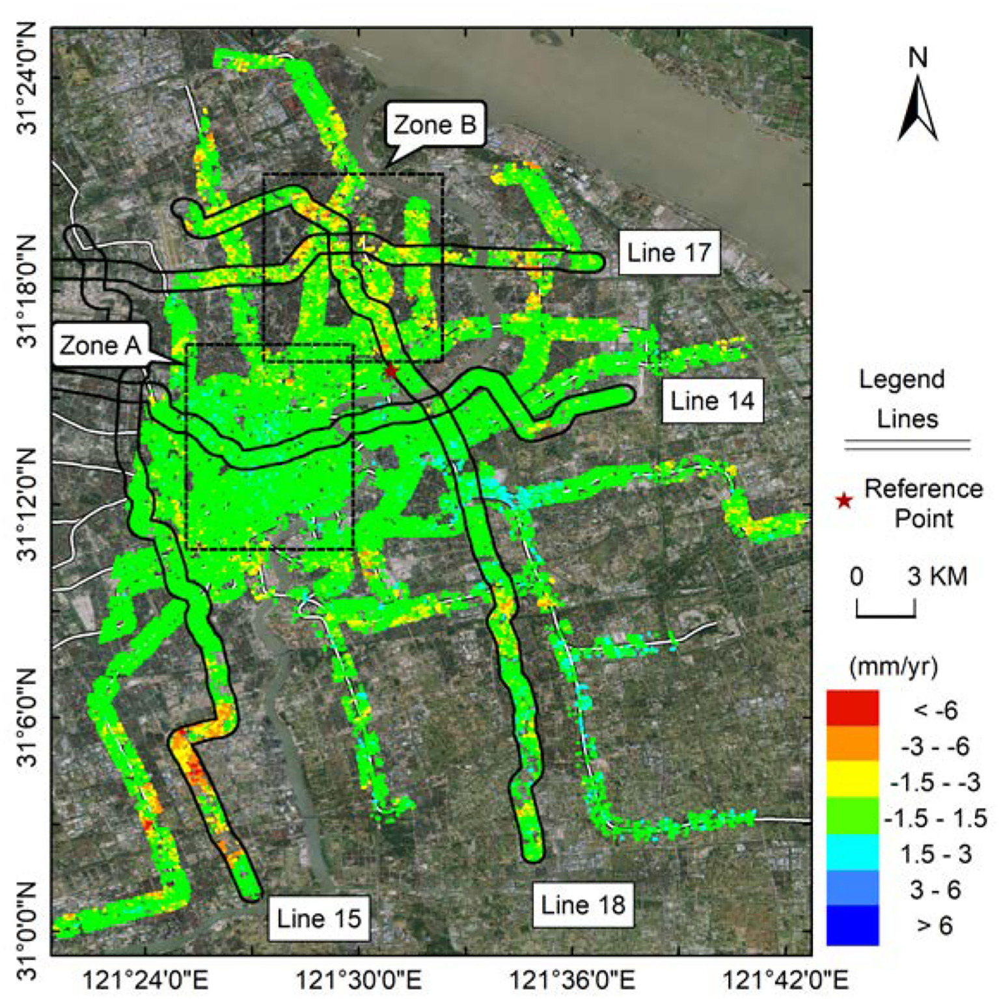
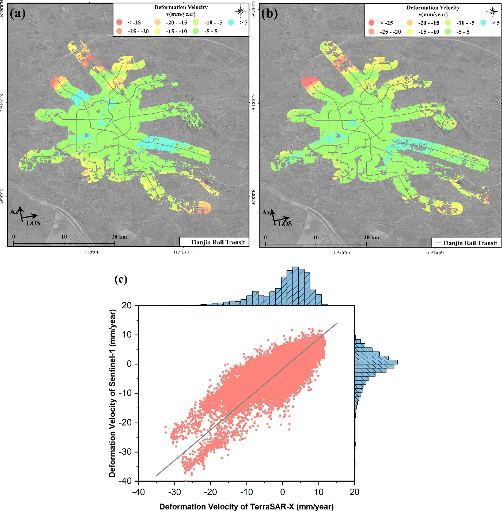
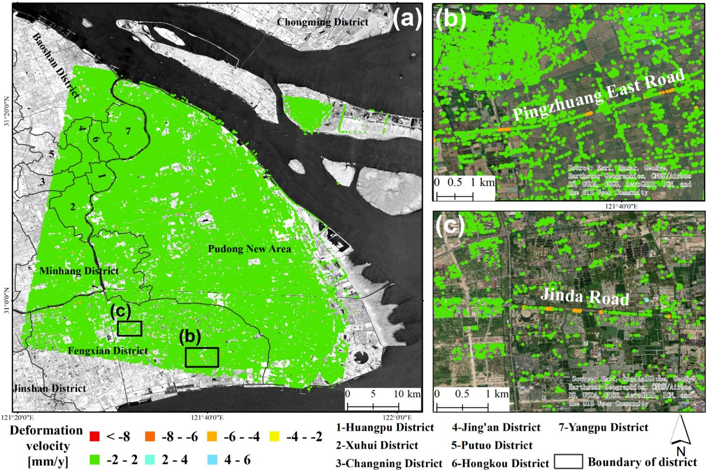

# Newly published #
## Exploring the InSAR Deformation Series Using Unsupervised Learning in a Built Environment ##
### Abstract ###

As a city undergoes large-scale construction and expansion, there is an urgent need to monitor the stability of the ground and infrastructure. The time-series InSAR technique is an effective tool for measuring surface displacements. However, interpreting these displacements in a built environment, where observed displacements consist of mixed signals, poses a challenge. This study uses principal component analysis (PCA) and the k-means clustering method for exploring deformation series within an unsupervised learning context. The PCA method extracts the dominant components in deformation series, whereas the clustering method identifies similar deformation series. This method was tested on Kunming City (KMC) using C-band Sentinel-1, X-band TerraSAR-X, and L-band ALOS-2 PALSAR-2 data acquired between 2017 to 2022. The experiment demonstrated that the suggested unsupervised learning approach can group PS points with similar kinematic characteristics. Five types of deformation kinematic characteristics were discovered in the three SAR datasets: upward, slight upward, stability, slight downward, and downward. According to the results, less than 20% of points exhibit significant motion trends, whereas 50% show small velocity values but still demonstrate movement trends. The remaining 30% are relatively stable. Similar clustering results were obtained from the three datasets using unsupervised methods, highlighting the effectiveness of identifying spatial–temporal patterns over the study area. Moreover, It was found that clustering based on kinematic characteristics enhances the interpretation of InSAR deformation, particularly for points with small deformation velocities. Finally, the significance of PCA decomposition in interpreting InSAR deformation was discussed, as it can better represent series with noise, enabling their accurate identification.

 

## Postconstruction Deformation Characteristics of High-Fill Foundations of Kunming Changshui International Airport Using Time-Series InSAR Technology ##
### Abstract ###
The Kunming Changshui International Airport was built on complex mountainous terrain with significant fluctuations in Southwest China. The site contains large areas of high fill susceptible to uneven ground deformation from filling material consolidation, dynamic loading from aircraft, and other factors. Thus, monitoring and analyzing the causes and characteristics of postconstruction deformation of high-fill foundations are crucial to the airport's safe operation. In this study, we obtained a total of 149 Sentinel-1A ascending SAR images from March 2017 to March 2022. We estimated the elevation error and corrected the topographic phase to mitigate the impact of large topographic fluctuations on monitoring. Then, we extracted ground subsidence results based on time-series InSAR technology. The results show that deformation mainly occurred in the high-fill areas during the monitoring period, whereas settlement was more pronounced when the fill height was over 30 m. The deformation rate is influenced by the height of the fill, ground reinforcement measures, and dynamic loading of aircraft. Using the Mann-Kendall trend analysis and Pettitt mutation test methods to detect temporal information from time-series points, we found that the time required for the foundation to reach a stable state after construction is not directly related to its residual subsidence. Other factors, such as construction measures also influence it.

 

## Complex surface displacements of the Nanyu landslide in Zhouqu, China revealed by multi-platform InSAR observations ##

### Abstract ###
The Zhouqu County of Gansu Province in northwestern China is a geological hazard-prone area with frequent landslide and debris flow events. As a recent example, the Jiangdingya landslide, a smaller landslide within the larger ancient Nanyu landslide, was reactivated and partially collapsed to block the Bailong River near the Nanyu Township on 12 July 2018. Previous studies have shown that heavy rainfall is the major triggering factor of the failure event, but the spatio-temporal pattern of surface displacements of the landslide remains unknown due to a lack of in-situ measurements on the slope. In this study, we retrieved the surface displacements of the Nanyu landslide before the slope failure event using time-series Synthetic Aperture Radar Interferometry (InSAR) analysis of Sentinel-1 and ALOS-2 PALSAR-2 data. Our results show that the ancient Nanyu landslide has been in an unstable state prior to the failure event. To investigate the spatial patterns in displacement, we inverted a quasi three-dimensional (3D) surface displacement field using multi-orbit InSAR measurements combined with the surface parallel flow model, which showed a significant spatial heterogeneity in displacement patterns across the ancient landslide. In particular, a sign of local reactivation was observed on the upper slopes, which might be related to recent road construction activities. Furthermore, the detectability of unstable slopes near the Nanyu landslide with Sentinel-1 and ALOS-2 PALSAR-2 observations was analyzed to deepen our knowledge on the optimal choice of SAR data for geohazards detection and monitoring.

 
  